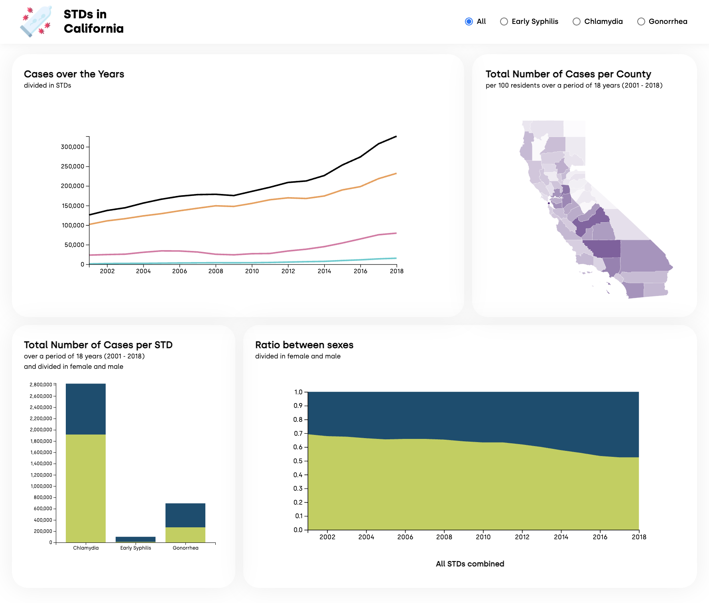

# STDs in California

This dashboard visualizes data from 2001 to 2018. The data contains case counts and rates for sexually transmitted diseases (chlamydia, gonorrhea, and early syphilis which includes primary, secondary, and early latent syphilis) reported for California residents, by disease, county, year, and sex.

View the dashboard here: https://stds-cali.netlify.app/ 



---
## Project setup
```
npm install
```

### Compiles and hot-reloads for development
```
npm run serve
```

### Compiles and minifies for production
```
npm run build
```

### Lints and fixes files
```
npm run lint
```

